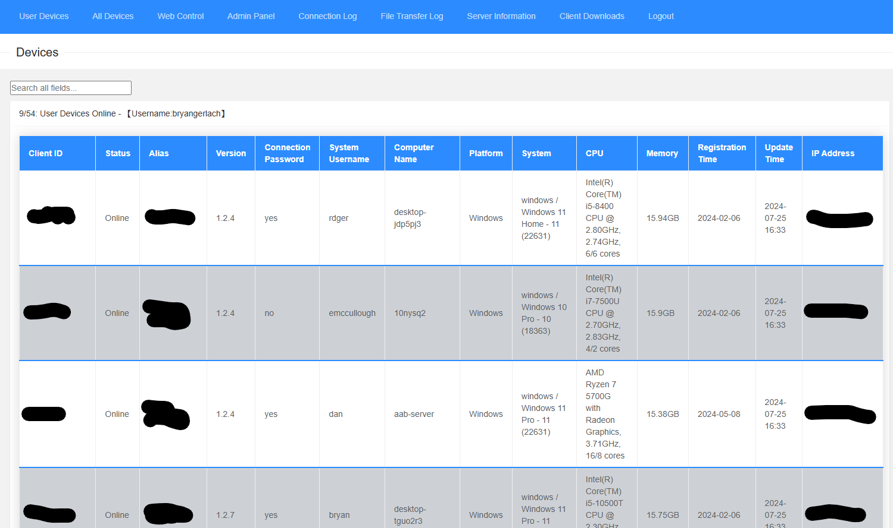
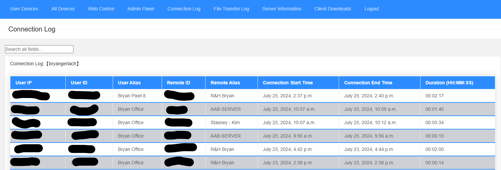
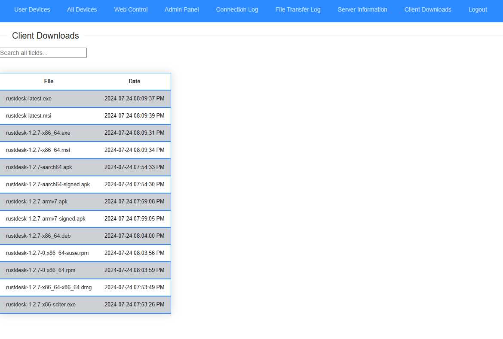

# rustdesk-api-server

## based on https://github.com/kingmo888/rustdesk-api-server






## Features

- Supports self-registration and login on the front-end webpage.
- Supports displaying device information on the front end, divided into administrator and user versions.
- Supports custom aliases (remarks).
- Supports backend management.
- Supports colored tags.
- Supports device online statistics.
- Supports saving device passwords.
- Automatically manages tokens and keeps them alive using the heartbeat interface.
- Supports sharing devices with other users.
- Supports web control terminal (currently only supports non-SSL mode, see below for usage issues)

## Installation

```bash
# Clone the code locally
git clone https://github.com/bryangerlach/rustdesk-api-server.git
# Enter the directory
cd rustdesk-api-server
# Install dependencies
pip install -r requirements.txt
python manage.py migrate
# After ensuring dependencies are installed correctly, execute:
# Please modify the port number yourself, it is recommended to keep 21114 as the default port for Rustdesk API
python manage.py runserver 0.0.0.0:21114
```

## Updating

```bash
#this assumes you have cloned the repo into /opt/rustdesk/rustdesk-api-server and have a service named rustdeskapi set up
systemctl stop rustdeskapi
cd /opt/rustdesk/rustdesk-api-server
git pull
pip install -r requirements.txt
python manage.py migrate
systemctl start rustdeskapi
```

**Client Downlaods**: You will need to generate your own client downloads with your server and key hard coded into the program. The easiest way to do this is using github actions https://rustdesk.com/docs/en/dev/build/all/

Now you can access it using `http://localhostIP:Port`.

**Note**: When configuring on CentOS, Django4 may have problems due to the low version of sqlite3 in the system. Please modify the file in the dependency library. Path: `xxxx/Lib/site-packages/django/db/backends/sqlite3/base.py` (Find the package address according to the situation), modify the content:
```python
# from sqlite3 import dbapi2 as Database   #(comment out this line)
from pysqlite3 import dbapi2 as Database # enable pysqlite3
```

## Environment Variables

| Variable Name | Reference Value | Note |
| ---- | ------- | ----------- |
| `HOST` | Default `0.0.0.0` | IP binding of the service |
| `TZ` | Default `Asia/Shanghai`, optional | Timezone |
| `SECRET_KEY` | Optional, custom a random string | Program encryption key |
| `CSRF_TRUSTED_ORIGINS` | Optional, verification off by default;<br>If you need to enable it, fill in your access address `http://yourdomain.com:21114` <br>**To disable verification, please delete this variable instead of leaving it blank** | Cross-origin trusted source |
| `ID_SERVER` | Optional, default is the same host as the API server.<br>Customizable like `yourdomain.com` | ID server used by the web control terminal |
| `DEBUG` | Optional, default `False` | Debug mode |
| `ALLOW_REGISTRATION` | Optional, default `True` | Whether to allow new user registration |
| Database Configuration | -- Start -- | If not using MYSQL, the following are unnecessary |
| `DATABASE_TYPE` | Optional, default `SQLITE3` | Database type (SQLITE/MYSQL) |
| `MYSQL_DBNAME` | Optional, default `-` | MYSQL database name |
| `MYSQL_HOST` | Optional, default `127.0.0.1` | MYSQL database server IP |
| `MYSQL_USER` | Optional, default `-` | MYSQL database username |
| `MYSQL_PASSWORD` | Optional, default `-` | MYSQL database password |
| `MYSQL_PORT` | Optional, default `3306` | MYSQL database port |
| Database Configuration | -- End -- | See [sqlite3 migration to mysql tutorial](/tutorial/sqlite2mysql.md) |

## Usage Issues

- Administrator Settings

  When there are no accounts in the database, the first registered account directly obtains super administrator privileges,

 and subsequently registered accounts are ordinary accounts.

- Device Information

  Tested, the client will send device information to the API interface regularly in the mode of installation as a service under non-green mode, so if you want device information, you need to install the Rustdesk client and start the service.

- Slow Connection Speed

  The new version Key mode connection speed is slow. You can start the service on the server without the -k parameter. At this time, the client cannot configure the key either.

- Web Control Terminal Configuration

  - Set the ID_SERVER environment variable or modify the ID_SERVER configuration item in the rustdesk_server_api/settings.py file and fill in the IP or domain name of the ID server/relay server.

- Web Control Terminal Keeps Spinning

  - Check if the ID server filling is correct.

  - The web control terminal currently only supports non-SSL mode. If the webui is accessed via https, remove the 's', otherwise ws cannot connect and keeps spinning. For example: https://domain.com/webui, change to http://domain.com/webui

- CSRF verification failed when logging in or logging out of backend operations. Request interrupted.

  This operation is highly likely to be a combination of docker configuration + nginx reverse proxy + SSL. Pay attention to modifying CSRF_TRUSTED_ORIGINS. If it is SSL, it starts with https, otherwise it is http.

## Other Related Tools

- [CMD script for modifying client ID](https://github.com/abdullah-erturk/RustDesk-ID-Changer)

- [rustdesk](https://github.com/rustdesk/rustdesk)

- [rustdesk-server](https://github.com/rustdesk/rustdesk-server)
